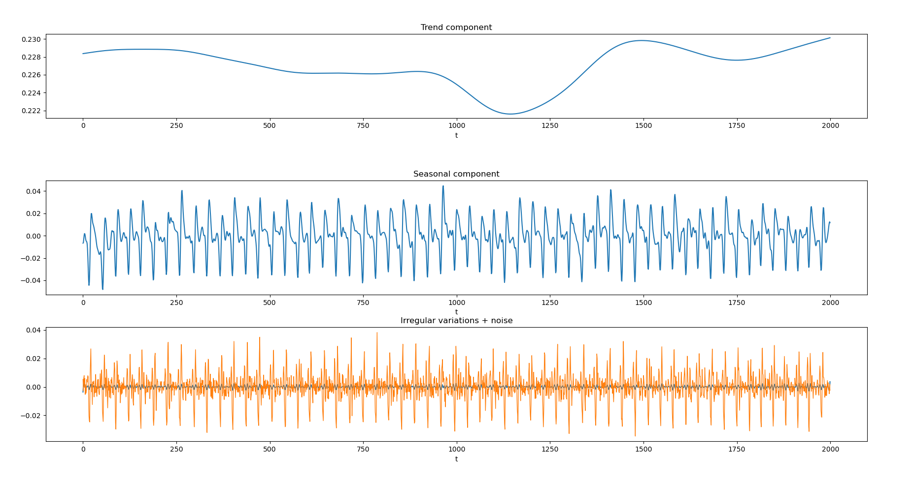

# TimeSeries-AnomalyDetection
Anomaly detection in time series for space applications.

Time series are functions of time which represent the evolution of some variables. Though these functions can be completely chaotic, it is usual to find concrete patterns in real life time series. In particular, when the variables are signals generated by space systems, such as telemetry data from a satellite, these patterns are highly related to the mission parameters (e.g. application orbit, exposure to Sun radiation, etc.). Therefore, time series in space applications are expected to have a certain degree of periodicity, due to the periodicity of orbits. Even if some signals are not periodic, during the operational phase most of the variables should remain stable around equilibrium points to assure the correct functioning of the system.

An anomaly can be defined as any variation of a time series that deviates from the nominal or expected behaviour. The underlying difficulty behind this concept is that some events can be anomalous or not depending on the context, so different techniques should be used to verify the anomaly.

This repository allows to perform different analysis over a time series in order to understand its behaviour and extract the relevant information.
The main implemented features are the Time Series Decomposition and Anomaly Detection.

For unexperienced users, there are several examples regarding:
  1) Noise reduction.
  2) Period estimation.
  3) Time series decomposition: STL (Seasonal and Trend decomposition using Loess). 
  4) Time series decomposition: MVD (Mean Value Decomposition). 
  5) Anomaly detection with spectral residual transformation.
  6) Anomaly detection with ADTK.
  7) Time series decomposition (STL + MVD), spectral residual transformation and anomaly detection with ADTK.
  8) NASA's anomaly database evaluation (highly time consuming).
  9) UCR's anomaly database evaluation (highly time consuming).
  10) Comparison between computational time for python and fortran filter.

New decomposition method developed: MVD (Mean Value Decomposition), with better performances than STL for some applications.
Fortran compiled code for optimization improvement and computational time reduction.

NASA's and UCR's database to evaluate the software performances.

## Universidad Politécnica de Madrid (UPM) - Technical UNiversity of Madrid
## Master Universitario en Sistemas Espaciales (MUSE) - Master Degree in Space Systems
## Instituto Ignacio Da Riva (IDR)
#### Developed by: David Huergo 
#### Supervised by: Juan Antonio Hernández
